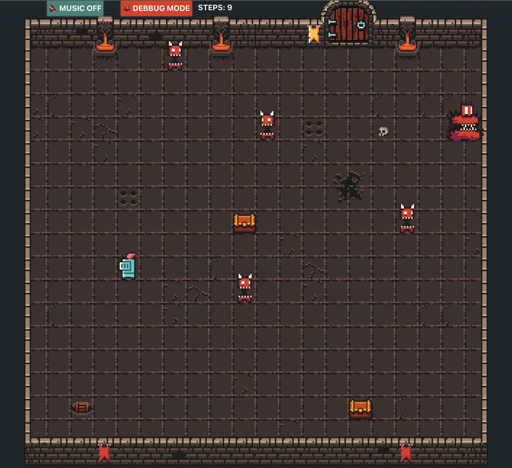

# React Game (version 1.0)

This project is being created with [React](https://react.dev/), [Zustand](https://github.com/pmndrs/zustand) and [Typescript](https://www.typescriptlang.org/)

## Demo Gif



## Local Run
In the project directory, you can run:

```bash
yarn && yarn start
```

Remove the third line in package.json 
```"homepage": "https://remato.github.io/react-game/",```
runs the app in the development mode and open [http://localhost:3000](http://localhost:3000) to view it in the browser.

## Live Version
You can see a live game version [here](https://remato.github.io/react-game)

